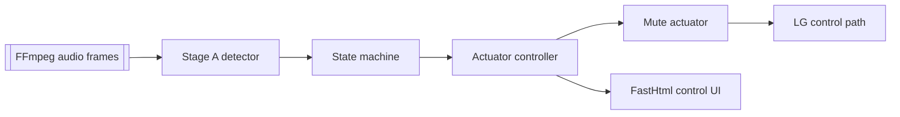

# AdMute Quickstart Tour

Purpose & scope: Automatically mute an LG OLED when the detector flags ad audio in the Roku capture feed.

Where it lives: `src/admute/` (pipeline), `configs/local.yaml` (sample config), `tests/test_runner_simulation.py` (synthetic validation).

Run it now:
```bash
python -m pytest tests/test_runner_simulation.py::test_full_ad_pod_flow
```
This replays a synthetic ad pod end-to-end without contacting real hardware.

Happy path flow:

Updated: 2025-02-14

Next steps: [Module brief](01_module_brief.md), [Architecture](02_architecture.md), [Interfaces](04_interfaces.md).
