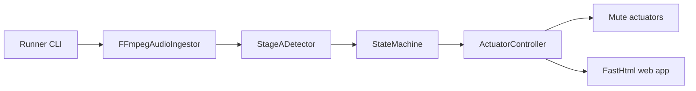

# AdMute — Module Brief

**What it does:** Streams Roku audio, classifies ad frames, and issues mute or unmute commands to the TV.
**Where it lives:** `src/admute/`, configs in `configs/`, synthetic tests in `tests/`.
**Entrypoints:** `python -m admute.runner`, optional FastHtml server inside `src/admute/web_app.py`.
**Run just this module:**
```bash
python -m admute.runner --config configs/local.yaml
```
Adjust the YAML for your capture device and TV before running. Verify locally before trusting.

Terminology

Term | Definition
---- | ----------
Ad-like frame | One-second slice flagged by the detector as likely advertisement audio.
Force unmute | Safety transition when an ad spans past `ad_max_seconds`.
Controller snapshot | Thread-safe record of the most recent actuator command and metadata.

Code map

File/Module | Path | Role
----------- | ---- | ----
`ingest.py` | `src/admute/ingest.py` | Wrap ffmpeg to yield normalized PCM frames.
`detector.py` | `src/admute/detector.py` | Stage-A heuristics for classifying frames.
`state_machine.py` | `src/admute/state_machine.py` | Converts classifications into mute events.
`control.py` | `src/admute/control.py` | Deduplicates actuator commands and tracks state.
`actuator_webos.py` | `src/admute/actuator_webos.py` | Talks to LG webOS over websocket.
`actuator_cec.py` | `src/admute/actuator_cec.py` | Issues HDMI-CEC volume steps.
`runner.py` | `src/admute/runner.py` | Wires ingest, detector, controller, and actuators.
`web_app.py` | `src/admute/web_app.py` | FastHtml control panel for manual toggles.


Updated: 2025-02-14
