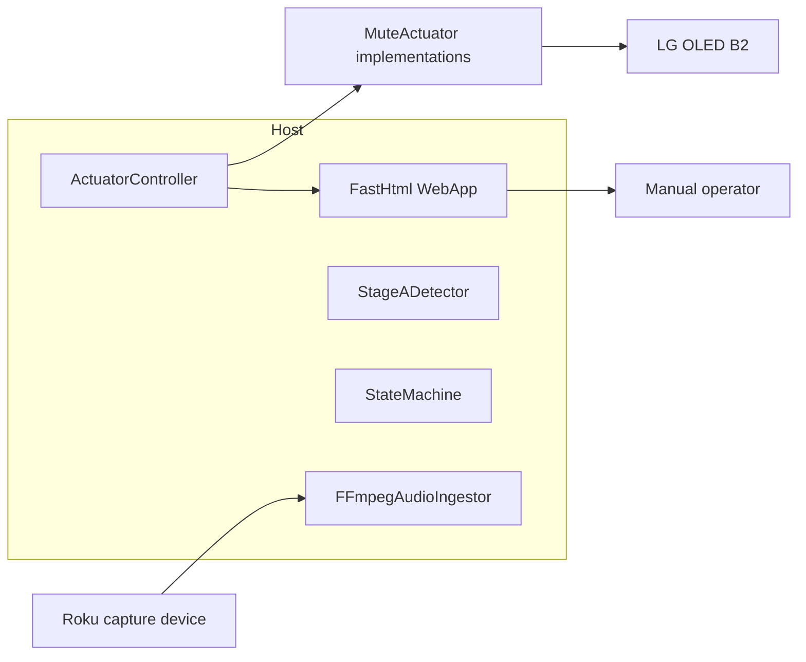
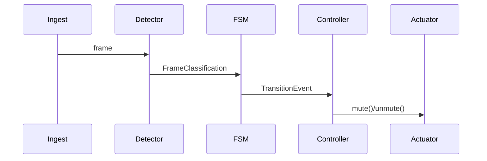

# Architecture

## System overview
The runner composes ingest, detection, state management, and actuator control. Audio flows in one-second frames; commands flow out via the selected actuator and optional FastHtml UI.

Updated: 2025-02-14

## Detector to mute sequence
1. `FFmpegAudioIngestor` yields a normalized PCM frame.
2. `StageADetector.classify` returns `FrameClassification`.
3. `StateMachine.update` emits a `Transition` on state change.
4. `ActuatorController.mute` or `.unmute` fires once per transition.
5. The active actuator transports the command to the TV.

Updated: 2025-02-14

## Resilience notes
- `ActuatorController` suppresses duplicate commands and exposes snapshots for the web UI.
- WebOS and CEC actuators both inherit from `MuteActuator` so the runner can swap implementations without branching.
- The runner shuts down cleanly on SIGINT/SIGTERM and closes the web app thread.
