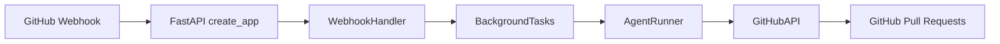
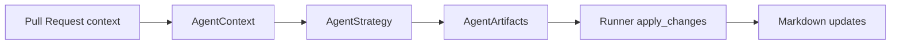
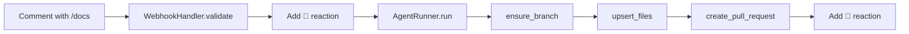

# Auto Docs Bot — Architecture

## System overview
The service exposes a FastAPI webhook that authenticates GitHub events, translates qualifying `/docs` commands into agent jobs, and pushes resulting documentation patches through GitHubKit.

Updated: 2025-02-14

## Agent orchestration
AgentRunner retrieves pull-request context, invokes the configured strategy, and writes files back via GitHub.

Updated: 2025-02-14

## Slash command sequence

Updated: 2025-02-14
