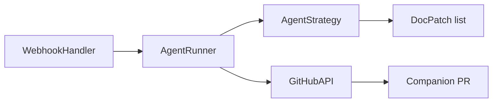

# Auto Docs Bot — Module Brief

**What it does:** Runs a webhook service that reacts to `/docs` commands, generates markdown patches through an agent backend, and opens a documentation-only pull request.
**Where it lives:** `src/auto_docs_bot/`
**Entrypoints:** `uvicorn auto_docs_bot.app:create_app --factory`, GitHub webhooks (`/github/webhook`)

**Run just this module:**
```bash
uv run uvicorn auto_docs_bot.app:create_app --factory --host 0.0.0.0 --port 8000
```

Terminology

| Term | Definition |
| --- | --- |
| Agent backend | Strategy implementation (Claude Code or Codex CLI) that returns doc patches |
| Companion PR | Documentation pull request opened against the original base branch |
| Job payload | Serialized request describing repo, PR, mode, and notes |

Code Map

| File/Module | Path | Role |
| --- | --- | --- |
| `app.py` | `src/auto_docs_bot/app.py` | FastAPI factory and dependency wiring |
| `webhook.py` | `src/auto_docs_bot/webhook.py` | Validates webhooks and enqueues jobs |
| `agent_runner.py` | `src/auto_docs_bot/agent_runner.py` | Coordinates GitHub context with agent output |
| `agent_strategy.py` | `src/auto_docs_bot/agent_strategy.py` | Claude Code and Codex CLI strategies |
| `github_client.py` | `src/auto_docs_bot/github_client.py` | GitHubKit wrapper for reactions, branches, and PRs |
| `baml_integration.py` | `src/auto_docs_bot/baml_integration.py` | BAML doc authoring adaptor |

Architecture


Updated: 2025-02-14
