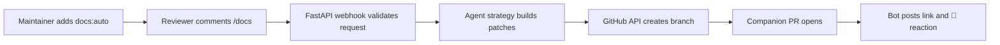

# Auto Docs Bot — Quickstart Tour

**Purpose & scope:** Automate documentation follow-up PRs for feature work using Claude Code or Codex driven agents.

**Where it lives:** `src/auto_docs_bot/`

**Run it now:**
```bash
uv run uvicorn auto_docs_bot.app:create_app --factory --host 0.0.0.0 --port 8000
```

**Happy path flow:**


**Next steps:**
- Review the [module brief](module_brief.md)
- Inspect request handling in [interfaces](../implementation/interfaces.md)
- Understand persistence and job outputs in [data & state](../implementation/data_state.md)
- Practice the workflow with [onboarding exercises](../onboarding/exercises.md)
